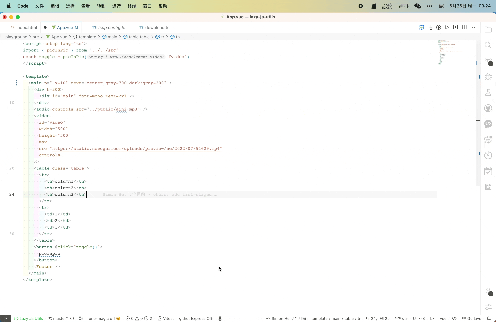

 English | <a href="./README_zh.md">简体中文</a>

Handle the space problem in pasted styles in unocss, such as bg-rgba(255,255,255,0.4) -> bg-[rgba(255,255,255,0.4)] and calc, etc. If there are better suggestions, you can configure further inside

### Feature
support attribute completions for unocss

### 🌰 Sample
- bg#fff -> bg-#fff
- maxw -> max-w
- bg-[rgba(255, 255, 255, 0.5)] -> bg-[rgba(255,255,255,0.5)]

## :coffee:

[buy me a cup of coffee](https://github.com/Simon-He95/sponsor)

## License

[MIT](./license)
